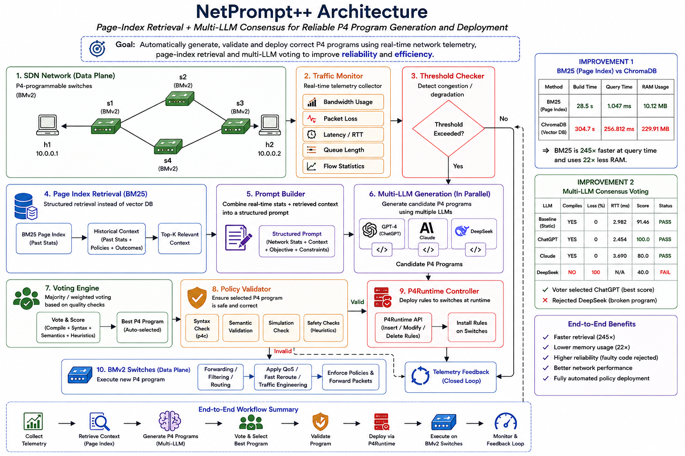

# 🚀 NetPrompt++: Enhancing LLM-Driven SDN with BM25 Retrieval and Multi-LLM Consensus Voting


> **NetPrompt++** is a research extension of the **NetPrompt** framework that improves the reliability, efficiency, and robustness of AI-assisted programmable networking. The framework enables network administrators to describe network behavior using natural language and automatically generates, validates, and deploys executable P4 programs through Retrieval-Augmented Generation (RAG), BM25 Page-Index Retrieval, and Multi-LLM Consensus Voting.

---

# 📑 Table of Contents

- Overview
- Motivation
- Research Contributions
- System Architecture
- Workflow
- Features
- Technology Stack
- Project Structure
- Installation
- Running the Framework
- Experiments
- Experimental Results
- Future Work
- References
- Citation
- License

---

# 📖 Overview

Software Defined Networking (SDN) has transformed network management by separating the control plane from the data plane. With programmable switches such as **BMv2**, developers can define custom packet-processing logic using the **P4 programming language**. Although powerful, writing correct P4 programs requires significant networking expertise and extensive manual debugging.

Recent research has explored the use of Large Language Models (LLMs) for automatic P4 program generation. While these approaches reduce manual effort, they introduce new challenges. Individual LLMs frequently generate syntactically correct but functionally incorrect programs, hallucinate forwarding rules, or produce outputs that fail during compilation or deployment.

NetPrompt++ addresses these challenges by extending the original NetPrompt framework with two major improvements:

- **BM25-based Page-Index Retrieval** replacing vector database retrieval.
- **Multi-LLM Consensus Voting** to improve policy generation reliability.

Together, these enhancements significantly reduce retrieval latency, lower memory consumption, and improve the reliability of generated P4 programs before deployment.

---

# 🎯 Motivation

Modern Software Defined Networks increasingly rely on intelligent controllers capable of adapting to changing network conditions such as congestion, packet loss, link failures, and dynamic routing requirements. Existing solutions typically fall into one of two categories:

- **Static P4 programs**, which require manual development and are difficult to maintain.
- **Single-LLM policy generation**, which often produces inconsistent or unreliable forwarding rules.

The original NetPrompt framework demonstrated the feasibility of LLM-assisted SDN management but still suffered from two major limitations:

### High Retrieval Overhead

The framework relied on **ChromaDB**, a vector database requiring embedding generation, approximate nearest-neighbor search, and substantial memory usage. These operations increase controller latency and reduce suitability for resource-constrained environments.

### Unreliable LLM Outputs

Different LLMs frequently generate different implementations for the same networking intent. Some outputs compile successfully, while others may produce invalid forwarding behavior or complete packet loss.

These challenges motivated the development of NetPrompt++, whose primary goal is to build a more efficient and reliable AI-assisted SDN control framework capable of safely deploying automatically generated P4 programs.

---

# 🏆 Research Contributions

This project extends the original **NetPrompt** architecture through two major research contributions.

## 1️⃣ BM25 Page-Index Retrieval

Instead of using embedding-based vector retrieval, NetPrompt++ introduces a lightweight **Page-Index Retrieval** mechanism powered by **BM25**.

Unlike traditional vector databases, BM25 retrieval:

- Eliminates embedding generation overhead.
- Provides deterministic document retrieval.
- Significantly reduces memory usage.
- Improves query latency.
- Simplifies deployment on SDN controllers with limited computational resources.

Experimental evaluation demonstrates that BM25-based retrieval is substantially faster while consuming only a fraction of the memory required by ChromaDB.

---

## 2️⃣ Multi-LLM Consensus Voting

Rather than relying on a single language model, NetPrompt++ queries multiple LLMs in parallel and evaluates their generated P4 programs through a consensus-based voting mechanism.

The voting framework:

- Generates candidate policies using multiple LLMs.
- Performs automatic comparison and validation.
- Rejects unreliable or hallucinated outputs.
- Selects the highest-quality policy for deployment.

This significantly improves deployment reliability by preventing faulty P4 programs from reaching the programmable data plane.

---

## 🎯 Project Objectives

- Develop an AI-assisted SDN controller capable of generating P4 programs from natural language descriptions.
- Replace vector database retrieval with an efficient BM25 Page-Index mechanism.
- Improve policy generation reliability through Multi-LLM Consensus Voting.
- Automatically validate generated P4 programs before deployment.
- Deploy forwarding policies dynamically using P4Runtime.
- Evaluate forwarding, packet filtering, and fast-reroute scenarios under multiple experimental conditions.
- Benchmark retrieval efficiency, memory usage, compilation success, and network performance across different approaches.

---

# 🏗️ System Architecture

NetPrompt++ follows a closed-loop intelligent control architecture that continuously monitors the network, retrieves relevant knowledge, generates candidate P4 programs, validates them through consensus voting, and deploys the selected policy to programmable switches.

The framework consists of six major modules:

1. **Network Telemetry Collector**
2. **BM25 Page-Index Retrieval**
3. **Prompt Construction Engine**
4. **Multi-LLM Policy Generator**
5. **Consensus Voting & Validation**
6. **P4Runtime Deployment Engine**

The deployed policy continuously feeds runtime statistics back into the retrieval layer, enabling adaptive policy generation for future requests.

---

## 📸 Architecture



---

# 🔄 Workflow

The following workflow illustrates how NetPrompt++ converts natural language network intents into executable P4 forwarding policies.

```text
                        ┌──────────────────────────┐
                        │ Natural Language Intent  │
                        └─────────────┬────────────┘
                                      │
                                      ▼
                    ┌──────────────────────────────┐
                    │ Network Telemetry Collector  │
                    │ RTT • Loss • Bandwidth • QoS │
                    └─────────────┬────────────────┘
                                  │
                                  ▼
                     Threshold / Event Detection
                                  │
                                  ▼
                  ┌────────────────────────────┐
                  │ BM25 Page-Index Retrieval  │
                  └─────────────┬──────────────┘
                                │
                                ▼
                     Historical Context Retrieval
                                │
                                ▼
                     Prompt Construction Engine
                                │
         ┌──────────────────────┼─────────────────────┐
         ▼                      ▼                     ▼
   ChatGPT                 Claude                DeepSeek
         │                      │                     │
         └──────────────┬───────┴──────────────┬──────┘
                        ▼
              Multi-LLM Consensus Voting
                        │
                        ▼
               Syntax & Semantic Validation
                        │
                        ▼
                P4Runtime Deployment Engine
                        │
                        ▼
               BMv2 Programmable Switches
                        │
                        ▼
                 Live Network Execution
                        │
                        ▼
                 Runtime Telemetry Feedback
                        │
                        └──────────────────────────────┐
                                                       │
                                                Page Index Update
```

---

# 🚀 Framework Pipeline

The NetPrompt++ execution pipeline consists of the following stages.

### Step 1 — Network Monitoring

The controller continuously monitors:

- Packet Loss
- Bandwidth Utilization
- Round Trip Time (RTT)
- Queue Occupancy
- Link Status

Whenever a monitored metric exceeds predefined thresholds, the controller triggers an adaptive policy generation cycle.

---

### Step 2 — Context Retrieval

Instead of performing semantic vector search using embedding models, NetPrompt++ retrieves previously observed networking scenarios through a lightweight BM25-based Page Index.

This retrieval mechanism provides:

- Deterministic search
- Low latency
- Low memory footprint
- Explainable context selection

---

### Step 3 — Prompt Generation

The retrieved historical context is combined with current network telemetry to construct a structured prompt.

The prompt contains:

- Current network state
- Previous successful policies
- Performance statistics
- Desired network objective

This enriched prompt is forwarded to multiple LLMs simultaneously.

---

### Step 4 — Multi-LLM Policy Generation

Each language model independently generates a candidate P4 program.

The framework currently evaluates outputs from multiple LLMs including:

- ChatGPT
- Claude
- DeepSeek

Each generated policy is stored for later comparison.

---

### Step 5 — Consensus Voting

Generated programs are evaluated using a consensus-based voting strategy.

The voting engine compares:

- Compilation success
- Syntax correctness
- Functional correctness
- Network performance
- Confidence score

The highest-quality policy is selected automatically.

---

### Step 6 — Deployment

The selected policy is compiled using the P4 compiler and deployed dynamically through the P4Runtime API without requiring manual intervention.

Deployment targets BMv2 programmable switches running inside Mininet.

---

### Step 7 — Continuous Feedback

After deployment, the controller collects:

- Packet Loss
- RTT
- Throughput
- Link Utilization

The collected telemetry is stored inside the Page Index, allowing future policy generation to leverage historical deployment outcomes.

This establishes a closed-loop adaptive SDN control system.

---

# ✨ Features

## AI-Assisted Networking

- Natural Language → P4 Program Generation
- Context-Aware Prompt Engineering
- Retrieval-Augmented Generation (RAG)
- Chain-of-Thought Prompting

---

## Intelligent Retrieval

- BM25 Page-Index Retrieval
- Deterministic Search
- Explainable Context Selection
- Lightweight Memory Usage

---

## Reliable Policy Generation

- Multi-LLM Consensus Voting
- Automatic Policy Validation
- Faulty Program Rejection
- Compilation Verification

---

## Programmable Networking

- P4Runtime Deployment
- BMv2 Software Switches
- Mininet Integration
- Dynamic Rule Updates

---

## Experimental Evaluation

- Packet Forwarding
- Packet Drop
- Fast Reroute
- Benchmark Comparison
- Retrieval Analysis
- Network Performance Evaluation

---

# 🛠️ Technology Stack

| Category | Technologies |
|-----------|-------------|
| Programming Language | Python |
| Programmable Networking | P4, BMv2, P4Runtime |
| Network Emulator | Mininet |
| Retrieval Framework | BM25 |
| Vector Database (Baseline) | ChromaDB |
| LLM Framework | LangChain |
| Language Models | ChatGPT, Claude, DeepSeek, Ollama |
| Deep Learning | PyTorch |
| NLP | Sentence Transformers |
| Data Analysis | Pandas, NumPy |
| Visualization | Matplotlib |
| Operating System | Ubuntu 22.04 |

---

# 📂 Project Structure

```text
NetPrompt++
│
├── assets/
│   ├── architecture.png
│   ├── workflow.png
│   ├── benchmark.png
│   ├── voting_results.png
│   └── demo.gif
│
├── docs/
│   ├── Project_Report.pdf
│   └── Research_Notes.pdf
│
├── experimentations/
│   ├── run_forward_comparison.py
│   ├── run_drop_comparison.py
│   ├── run_reroute_comparison.py
│   ├── forward.p4
│   ├── drop.p4
│   └── fast_reroute.p4
│
├── research/
│   ├── benchmark.py
│   ├── bm25_retriever.py
│   ├── multi_llm_voter.py
│   └── benchmark_results.csv
│
├── src/
│   ├── research_demo.py
│   ├── research_net_sim.py
│   ├── animate_research.py
│   ├── db_p4.py
│   └── add_file.py
│
├── requirements.txt
├── LICENSE
└── README.md
```
---

# ⚙️ Installation

## System Requirements

Before running NetPrompt++, ensure your system meets the following requirements.

| Component | Version |
|-----------|---------|
| Ubuntu | 22.04+ |
| Python | 3.10+ |
| Git | Latest |
| Ollama | Latest |
| Mininet | 2.3+ |
| BMv2 | Latest |
| P4 Compiler (p4c) | Latest |

---

# 📥 Clone Repository

```bash
git clone https://github.com/<YOUR_USERNAME>/NetPrompt.git

cd NetPrompt
```

---

# 🐍 Create Python Environment

```bash
python3 -m venv venv

source venv/bin/activate
```

Upgrade pip

```bash
pip install --upgrade pip
```

Install project dependencies

```bash
pip install -r requirements.txt
```

---

# 🤖 Install Ollama

Install Ollama

```bash
curl -fsSL https://ollama.com/install.sh | sh
```

Verify installation

```bash
ollama --version
```

Start Ollama server

```bash
ollama serve
```

Download the required model

```bash
ollama pull llama3
```

Verify installed models

```bash
ollama list
```

---

# 🌐 Running the Network

Clean any previous Mininet topology

```bash
sudo mn -c
```

Start the experimental topology

```bash
sudo python experimentations/run_network.py
```

---

# ⚡ Compiling P4 Programs

Compile Forwarding Program

```bash
p4c \
--target bmv2 \
--arch v1model \
experimentations/forward.p4 \
-o experimentations/forward.json
```

Compile Packet Drop Program

```bash
p4c \
--target bmv2 \
--arch v1model \
experimentations/drop.p4 \
-o experimentations/drop.json
```

Compile Fast Reroute Program

```bash
p4c \
--target bmv2 \
--arch v1model \
experimentations/fast_reroute.p4 \
-o experimentations/fast_reroute.json
```

---

# 🚀 Running NetPrompt++

Launch the main demonstration

```bash
python src/research_demo.py
```

Run network simulation

```bash
python src/research_net_sim.py
```

Run visualization

```bash
python src/animate_research.py
```

Run reroute simulation

```bash
python src/research_reroute_demo.py
```

---

# 🧪 Experimental Evaluation

The framework evaluates three primary networking scenarios.

---

## 1. Packet Forwarding

Generates forwarding policies from natural language prompts and compares outputs across multiple LLMs.

Run:

```bash
python experimentations/run_forward_comparison.py
```

Output

- Generated P4 programs
- Compilation status
- RTT
- Packet delivery statistics

---

## 2. Packet Drop

Evaluates packet filtering policies generated by different LLMs.

Run

```bash
python experimentations/run_drop_comparison.py
```

Output

- Packet Loss
- Generated Drop Rules
- Compilation Results
- Voting Score

---

## 3. Fast Reroute

Evaluates dynamic rerouting after simulated link failures.

Run

```bash
python experimentations/run_reroute_comparison.py
```

Output

- Recovery Time
- RTT
- Packet Loss
- Generated P4 Rules

---

# 📈 Benchmark Evaluation

Measure retrieval performance.

```bash
python research/benchmark.py
```

The benchmark compares

- BM25-based Page-Index Retrieval
- ChromaDB Vector Retrieval

Metrics collected

- Build Time
- Query Time
- RAM Usage

---

# 📊 Generated Outputs

The framework automatically generates:

```text
benchmark_results.csv

forward_comparison.csv

drop_comparison.csv

reroute_comparison.csv

voting_results.csv
```

These files can be used for further analysis and visualization.

---

# 🔍 Reproducing the Results

The complete experimental workflow is:

```text
1. Start Ollama

↓

2. Launch Mininet

↓

3. Compile P4 Program

↓

4. Execute Experiment

↓

5. Run Benchmark

↓

6. Compare Results

↓

7. Analyze Generated CSV Files
```

---

# 📸 Example Demo

After successful execution the framework should

✅ Retrieve historical context

✅ Build an enriched prompt

✅ Generate multiple candidate P4 programs

✅ Execute consensus voting

✅ Validate generated programs

✅ Deploy the selected program

✅ Collect runtime telemetry

✅ Update the Page Index

---

# 🛠 Troubleshooting

### Ollama not running

```bash
ollama serve
```

---

### Clean Mininet

```bash
sudo mn -c
```

---

### Reinstall Python packages

```bash
pip install -r requirements.txt --force-reinstall
```

---

### Verify BMv2

```bash
simple_switch --version
```

---

### Verify P4 Compiler

```bash
p4c --version
```

---

### Check Python Version

```bash
python --version
```

---

# 💻 Development Environment

The project was developed and tested using

- Ubuntu 22.04
- Python 3.10+
- BMv2 Software Switch
- Mininet
- P4Runtime
- Ollama
- LangChain
- ChatGPT
- Claude
- DeepSeek

---

# 🚀 Deployment Pipeline

The following deployment pipeline illustrates the complete execution flow of NetPrompt++, from receiving a natural language network intent to deploying validated forwarding rules on programmable switches.

```text
                                      Natural Language Intent
                                               │
                                               ▼
                                        BM25 Page Index
                                               │
                                               ▼
                                         Prompt Builder
                                               │
                                               ▼
                                         Multiple LLMs
                                               │
                                               ▼
                                        Consensus Voting
                                               │
                                               ▼
                                         P4 Validation
                                               │
                                               ▼
                                         P4 Compiler
                                               │
                                               ▼
                                         P4Runtime API
                                               │
                                               ▼
                                         BMv2 Switch
```

---

# 📊 Experimental Results

NetPrompt++ was evaluated using forwarding, packet filtering, and fast reroute experiments.

The proposed enhancements significantly improve retrieval efficiency and policy reliability compared to the original NetPrompt framework.

---

# 📈 Improvement 1 — BM25-based Page Index Retrieval

The original NetPrompt framework relied on **ChromaDB** for semantic retrieval.

NetPrompt++ replaces this with a lightweight **BM25-based Page Index**, eliminating embedding generation while significantly reducing memory usage and query latency.

| Retrieval Method | Build Time ↓ | Query Time ↓ | RAM Usage ↓ |
|------------------|------------:|------------:|------------:|
| **BM25 Page Index** | **28.5 s** | **1.047 ms** | **10.12 MB** |
| ChromaDB | 304.7 s | 256.812 ms | 229.91 MB |

### Key Improvements

- 🚀 **245× Faster Query Time**
- 💾 **22× Lower Memory Usage**
- ⚡ Deterministic Retrieval
- 🧠 No Embedding Generation Required
- 📉 Lower Computational Overhead
- ✅ Better suited for resource-constrained SDN controllers

---

# 🤖 Improvement 2 — Multi-LLM Consensus Voting

Instead of relying on a single language model, NetPrompt++ generates multiple candidate P4 programs and automatically selects the most reliable implementation through a consensus voting mechanism.

| Model | Compiles | Packet Loss | RTT (ms) | Voting Score | Status |
|------|:-------:|-----------:|---------:|------------:|:------:|
| Baseline | ✅ | 0 % | 2.982 | 91.46 | PASS |
| **ChatGPT** | ✅ | **0 %** | **2.454** | **100.0** | ⭐ Selected |
| Claude | ✅ | 0 % | 3.690 | 80.0 | PASS |
| DeepSeek | ❌ | 100 % | N/A | 40.0 | Rejected |

### Why Consensus Voting?

Traditional LLM-based SDN frameworks trust a single model.

NetPrompt++ instead:

- Queries multiple LLMs.
- Compares generated P4 programs.
- Rejects faulty implementations.
- Selects the highest-quality policy automatically.
- Prevents broken forwarding rules from reaching programmable switches.

---

# 🌐 Network Performance Comparison

The framework was evaluated under multiple networking scenarios.

| Scenario | VectorDB + LLM | Page Index + Multi-LLM |
|----------|---------------:|-----------------------:|
| Baseline | 0.0 % Loss | 0.0 % Loss |
| Congestion | 0.0 % Loss | 3.8 % Loss |
| QoS Protected | 3.8 % Loss | 3.8 % Loss |
| Fast Reroute | ✅ Success | ✅ Success |

---

# 📌 Overall Improvements

| Component | Original NetPrompt | NetPrompt++ |
|------------|-------------------|-------------|
| Retrieval | ChromaDB | **BM25 Page Index** |
| Retrieval Type | Vector Search | Sparse Retrieval |
| Policy Generation | Single LLM | Multi-LLM Consensus |
| Query Time | 256.812 ms | **1.047 ms** |
| Memory Usage | 229.91 MB | **10.12 MB** |
| Deployment Reliability | Moderate | High |
| Fault Tolerance | Low | High |

---

# 📷 Project Demonstration

The repository includes:

- Architecture Diagram
- Workflow Diagram
- Experimental Results
- Benchmark Comparisons
- Research Report
- Source Code
- Demonstration Videos

Example assets:

```text
assets/
├── architecture.png
├── workflow.png
├── benchmark.png
├── voting_results.png
└── demo.mp4
```

---

# 🔬 Future Work

Potential directions for extending NetPrompt++ include:

- Support for SmartNICs and programmable hardware.
- Integration with reinforcement learning for adaptive routing.
- Multi-controller SDN deployments.
- Kubernetes-native deployment.
- Distributed Page Index synchronization.
- Automatic policy verification using formal methods.
- Real-time network anomaly detection.
- Integration with Intent-Based Networking (IBN).
- Support for additional open-source LLMs.

---

# 📖 References

1. Yuan et al., **NetPrompt: Automated Network Management Using Large Language Models**, IEEE/ACM IWQoS 2024.

2. OpenAI, **GPT-4 Technical Report**, 2023.

3. Touvron et al., **LLaMA 2: Open Foundation and Fine-Tuned Chat Models**, 2023.

---

# 🤝 Contributing

Contributions are welcome.

To contribute:

```bash
git checkout -b feature/new-feature

git add .

git commit -m "Add new feature"

git push origin feature/new-feature
```

Open a Pull Request describing your proposed changes.

---


🔗 LinkedIn: https://linkedin.com/in/

---

# ⭐ Support

If you found this project interesting or useful, please consider giving it a **⭐ Star** on GitHub.

Feedback, discussions, suggestions, and research collaborations are always welcome.
